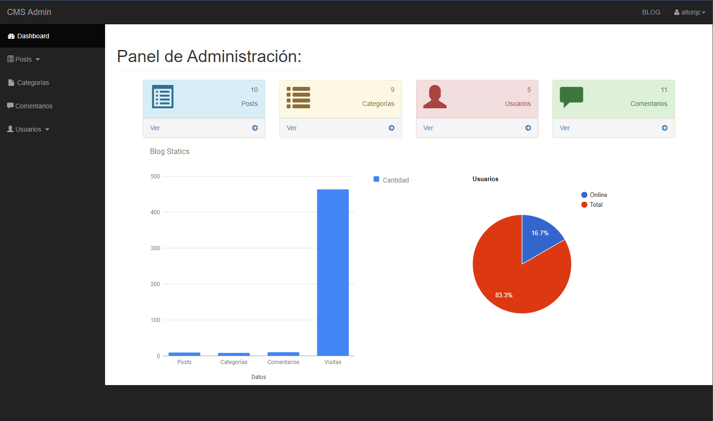
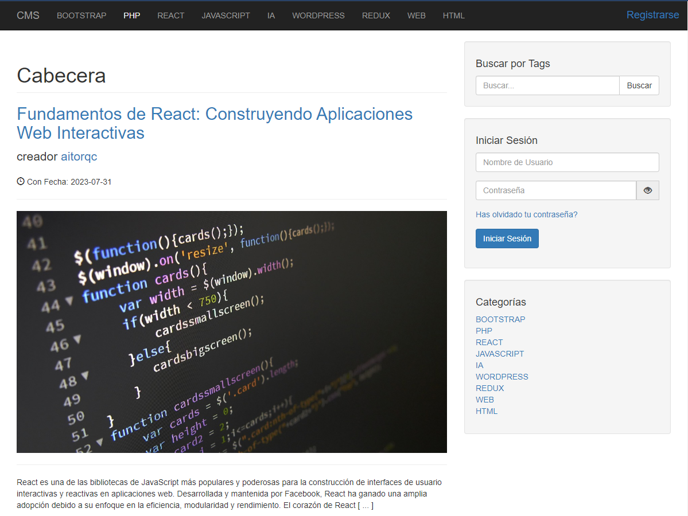

# Blog de Programación

Este proyecto es un blog de programación donde los usuarios pueden leer y compartir artículos relacionados con la programación y la tecnología.

## Tecnologías Utilizadas

- HTML5
- CSS3
- JavaScript
- PHP
- MySQL

## Capturas de Pantalla

Aquí hay algunas capturas de pantalla del proyecto:

## Enlace a la Web

Visita el blog en [blogaboutprogramming.online](https://blogaboutprogramming.online).
